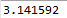
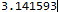
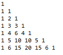
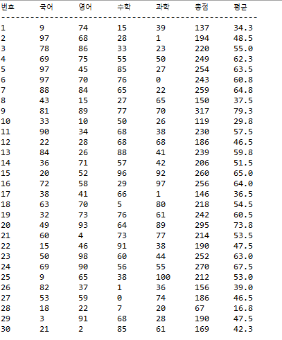

### Homework1

```java
public class Homework1 {

	public static void main(String[] args) {
		// TODO Auto-generated method stub
		int i,j;
		for(i=0; i<10; i++) {
			  for(j=0; j<=i; j++) {
			    System.out.print(" ");
			  }
			  for(; j<=10; j++) {
			    System.out.print("#");
			  }
			  System.out.println();
         }
		
		for(i=0; i<10; i++) {
			  for(j=0; j<=i; j++) {
			    System.out.print("#");
			  }
			  for(; j<=10; j++) {
			    System.out.print(" ");
			  }
			  System.out.println();
	}
		
		for(i=10; i>=0; i--) {
			  for(j=0; j<=i; j++) {
			    System.out.print("#");
			  }
			  for(; j<=10; j++) {
			    System.out.print(" ");
			  }
			  System.out.println();
			  }
		
		for(i=10; i>=0; i--) {
			  for(j=0; j<=i; j++) {
			    System.out.print(" ");
			  }
			  for(; j<=10; j++) {
			    System.out.print("#");
			  }
			  System.out.println();
		}
	}
}
```


### Homework2
```java
public class HomeWork2 {
    public static void main(String[] args) {
        int i = 1; 
        int j = 1; 
        int k;

        System.out.print(i + "," + j);

        for(int count = 3; count <= 20; count++) {
            k = i + j;                 
            System.out.print("," + k); 

            i = j; 
            j = k; 
        }
    }
}
 ```

### Homework3
```java
### Homework3
public class Homework3 {
    public static void main(String[] args) {

        double i = 1;
        double j = 1;
        double k;
        
        for (int count = 3; count <= 20; count++) {
            k = i + j; 
           
            double ratio = k / j; 
            
            System.out.printf("%.6f\n", ratio);
            
          
            i = j;
            j = k;
        }
    }
}

```

### Homework4
```java
public class Homework4 {
    public static void main(String[] args) {
        
        // i는 곱하는 수 (1부터 9까지 행 변경)
        for (int i = 1; i <= 9; i++) {
            
            // j는 구구단의 단 (1단부터 9단까지 열 변경)
            for (int j = 1; j <= 9; j++) {
                // \t는 탭 공백으로, 줄을 깔끔하게 맞춰줍니다.
                System.out.print(j + "*" + i + "=" + (j * i) + "\t");
            }
            
            // 한 행(i)의 출력이 끝나면 줄바꿈
            System.out.println();
        }
    }
}
```

### Homework5
```java
public class Homework5 {
    public static void main(String[] args) {

        int i, j;
        double radius = 0;
        
        for(i=1; i<=10000000; i++) {
        	if (i % 4 == 1) {
        		radius += 4*(1.0/i);
        	}
        	else if (i % 4 ==3) {
        		radius -= 4*(1.0/i);
        	}
        }
       
        	System.out.printf("%.6f", radius);
    }
}
```

### Homework5-1
```java
public class Homework5_1 {
    public static void main(String[] args) {

        int i;
        double pi = 0;
        for(i=0; i<=1000000;i++) {
        	if(i%2 == 0) {
        		pi += (Math.pow(3,-i)/(2 * i + 1));
        	}
        	else {
        		pi -= (Math.pow(3, -i)/(2 * i  + 1));
        	}
        }
        pi = pi * Math.sqrt(12);
        System.out.printf("%.6f", pi);
    }
}
```

### Homework6
```java
public class Homework6 {
    public static void main(String[] args) {

        int[][] binomial = new int[n][];

        for (int i = 0; i < n; i++) {
            binomial[i] = new int[i + 1];
            binomial[i][0] = 1; 
            binomial[i][i] = 1; 

            for (int j = 1; j < i; j++) {
           
                binomial[i][j] = binomial[i - 1][j - 1] + binomial[i - 1][j];
            }
        }


        for (int i = 0; i < n; i++) {
            for (int j = 0; j <= i; j++) {
                System.out.print(binomial[i][j] + " ");
            }
            System.out.println();
        }
    }
}
```

### Homework7
```java
public class Homework7 {
    public static void main(String[] args) {

        int data[] = new int[20];
        for (int i = 0; i < 20; i++) {
            data[i] = (int) (Math.random() * 100);
        }

        System.out.println("=== 정렬 전 ===");
        for (int i = 0; i < 20; i++) {
            System.out.print(data[i] + " ");
        }
        System.out.println("\n");

        for (int i = 0; i < data.length - 1; i++) {
            int minIndex = i; 
            
            for (int j = i + 1; j < data.length; j++) {
                if (data[j] < data[minIndex]) {
                    minIndex = j;
                }
            }
            
            int temp = data[i];
            data[i] = data[minIndex];
            data[minIndex] = temp;
        }

        System.out.println("=== 정렬 후 ===");
        for (int i = 0; i < 20; i++) {
            System.out.print(data[i] + " ");
        }
        System.out.println();
    }
}
```

### Homework8
```java
public class Homework8{
    public static void main(String[] args) {
        
        int[][] score = new int[30][4];

        
        for (int i = 0; i < 30; i++) {
            for (int j = 0; j < 4; j++) {
                score[i][j] = (int) (Math.random() * 101); 
            }
        }

        System.out.println("번호\t국어\t영어\t수학\t과학\t총점\t평균");
        System.out.println("-----------------------------------------------------");

       
        for (int i = 0; i < 30; i++) {
            int sum = 0;

            System.out.print((i + 1) + "\t");
            
            for (int j = 0; j < 4; j++) {
                System.out.print(score[i][j] + "\t");
                sum += score[i][j];
            }
            
            double avg = sum / 4.0;
            
            System.out.printf("%d\t%.1f\n", sum, avg);
        }
    }
}
```

