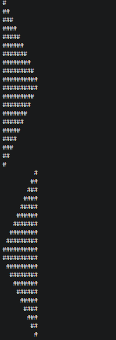
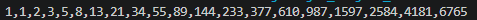
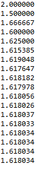
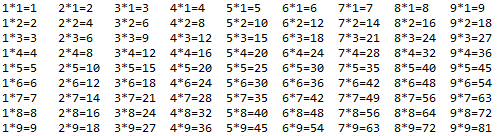

### Homework1

```java
public class Homework1 {

	public static void main(String[] args) {
		// TODO Auto-generated method stub
		int i,j;
		for(i=0; i<10; i++) {
			  for(j=0; j<=i; j++) {
			    System.out.print(" ");
			  }
			  for(; j<=10; j++) {
			    System.out.print("#");
			  }
			  System.out.println();
         }
		
		for(i=0; i<10; i++) {
			  for(j=0; j<=i; j++) {
			    System.out.print("#");
			  }
			  for(; j<=10; j++) {
			    System.out.print(" ");
			  }
			  System.out.println();
	}
		
		for(i=10; i>=0; i--) {
			  for(j=0; j<=i; j++) {
			    System.out.print("#");
			  }
			  for(; j<=10; j++) {
			    System.out.print(" ");
			  }
			  System.out.println();
			  }
		
		for(i=10; i>=0; i--) {
			  for(j=0; j<=i; j++) {
			    System.out.print(" ");
			  }
			  for(; j<=10; j++) {
			    System.out.print("#");
			  }
			  System.out.println();
		}
	}
}
```


### Homework2
```java
public class HomeWork2 {
    public static void main(String[] args) {
        int i = 1; 
        int j = 1; 
        int k;

        System.out.print(i + "," + j);

        for(int count = 3; count <= 20; count++) {
            k = i + j;                 
            System.out.print("," + k); 

            i = j; 
            j = k; 
        }
    }
}
 ```


```java
### Homework3
public class Homework3 {
    public static void main(String[] args) {

        double i = 1;
        double j = 1;
        double k;
        
        for (int count = 3; count <= 20; count++) {
            k = i + j; 
           
            double ratio = k / j; 
            
            System.out.printf("%.6f\n", ratio);
            
          
            i = j;
            j = k;
        }
    }
}

```

### Homework4
```java
public class Homework4 {
    public static void main(String[] args) {
        
        // i는 곱하는 수 (1부터 9까지 행 변경)
        for (int i = 1; i <= 9; i++) {
            
            // j는 구구단의 단 (1단부터 9단까지 열 변경)
            for (int j = 1; j <= 9; j++) {
                // \t는 탭 공백으로, 줄을 깔끔하게 맞춰줍니다.
                System.out.print(j + "*" + i + "=" + (j * i) + "\t");
            }
            
            // 한 행(i)의 출력이 끝나면 줄바꿈
            System.out.println();
        }
    }
}
```

